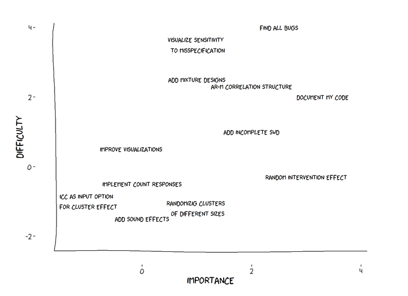
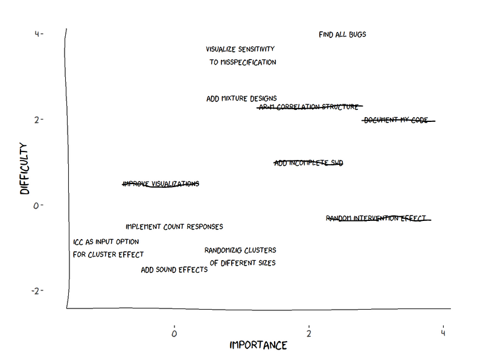

```{r setup, include=FALSE}
knitr::opts_chunk$set(echo = FALSE)
knitr::opts_knit$set(root.dir = "D:/Dateien/R-Code/SteppedPower/inst/scripts")
library(SteppedPower)
library(pander)
```

## Über `SteppedPower`

* ein `R`-Paket zur Powerberechnung von Stepped Wedge Designs
* (re)submitted zu CRAN (in den nächsten Tagen/Wochen dort vorhanden)

## Stepped Wedge Design im Allgemeinen 1

* sind geeignet zur Analyse von clusterrandomisierten Interventionsstudien
* alle Cluster beginnen mit einer Kontrollphase und enden in einer Interventionsphase.
* der Interventionsstart wird dabei für die einzelnen Cluster auf verschiedene
 Zeitpunkte randomisiert.
* Es findet kein Rückwechsel von Interventions- zu Kontroll-phase statt.

## Stepped Wedge Design im Allgemeinen 2

Als Beispiel das Studiendesign der KiDSafe-Studie.  

Hier wechseln zwölf Kliniken (Cluster)
zu unterschiedlichen Zeitpunkten von der Standardversorgung (blau)
in die Interventionsversorgung (rot).

```{r, echo=FALSE}
DM <- construct_DesMat(c(2,2,2,0,2,2,2,0), trtDelay=.5)
plot(DM)
```

## Idee von `SteppedPower` 

* Annehmen, dass die Varianz der Zielgröße sowie die Korrelationsstruktur 
(innerhalb von Clustern zu verschiedenen Zeitpunkten) bekannt ist. 
* Damit kann Beziehung von Zielgröße zu Interventionsstatus 
als ein verallgemeinertes kleinste Quadrate-Schätzer (WLS) ausgedrückt werden.
* In einem WLS kann man die Varianz des Effektschätzers $\hat\beta$ mittels der
Designmatrix (oft auch Modellmatrix) $X$ und der Kovarianzstuktur $\Omega$ berechnen.
$$ \text{Var}(\hat\beta) = (X'\Omega^{-1}X)^{-1} $$ 
* Mit Hilfe dieser Varianz kann man bei gegebener Effektgröße und Signifikanzniveau
die Power eines Z-Tests berechnen.

## Aufbau von `SteppedPower

* Hauptfunktion des Pakets heißt `wlsPower`. 

* Diese ruft mehrere Funktionen auf, u.a. `construct_DesMat` und 
`construct_CovMat` um die Designmatrix $X$ und die Kovarianzmatrix $\Omega$ 
zu erzeugen.  
Damit kann dann $\text{Var}(\hat\beta)$ ausgerechnet werden.
* Duch das explizite Berechnen ist diese Vorgehensweise sehr flexibel.


## Stand beim letzten Mal




## Stand beim letzten Mal




## Beispiel

Orientiert an einer Fallzahlplanung für einen Projektantrag (EXPRESSMED).  

Durch eine Intervention (bestehend aus verschiedenen Kursen und Übungen) soll
die psychische Belastung von Angestellten an Hochschulen gesenkt werden - 
gemessen als stetige Zielgröße mittels des CORE-OM-Fragebogen.

In verschiedenen Hochschulen werden Teilnehmer rekrutiert, die dann, je nach 
Hochschule zu unterschiedlichen Zeitpunkten mit der Intervention beginnen. 
Zu beachten ist dabei, dass die gleichen Teilnehmer über den gesamten 
Studienzeitraum beobachtet werden. 


### 

```{r}
tau <- .07 ; eta <- .1 
```

```{r, echo=TRUE}
model1 <- wlsPower(rep(1,6), mu0=0, mu1=.33,
                   sigma=1, tau=tau, eta=eta, rho=.1, N=20, verbose=2)
```

### Komplettes Design

```{r}
cat("Power =", model1$Power)
plot(model1)
```

### mit Auslassen von Beobachtungen

```{r, echo=TRUE}
model2 <- wlsPower(rep(1,6), mu0=0, mu1=.33,
                   sigma=1, tau=tau, eta=eta, N=20, verbose=2, incomplete=4)
```

```{r}
cat("Power =", model2$Power)
plot(model2)
```


## Aktueller Stand

```
library(devtools)
install_github("PMildenb/SteppedPower", buildvignettes=TRUE)
```
oder ab in einigen Tagen

```
install.packages("SteppedPower")
```

